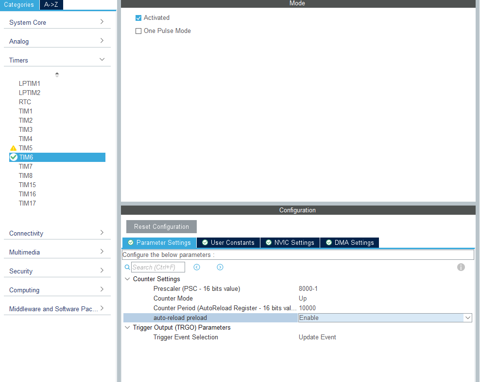
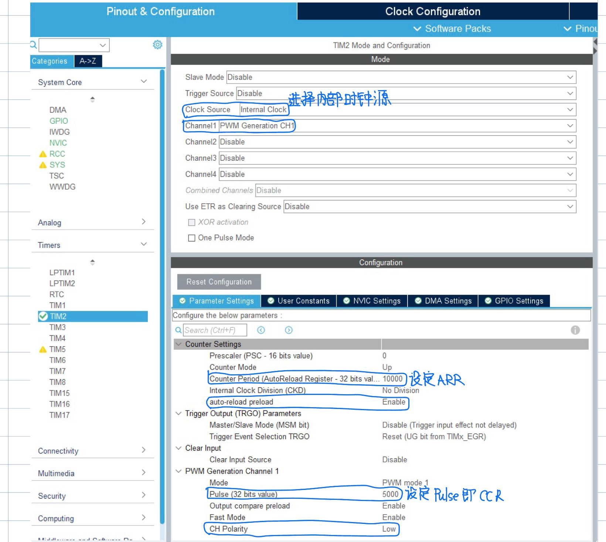
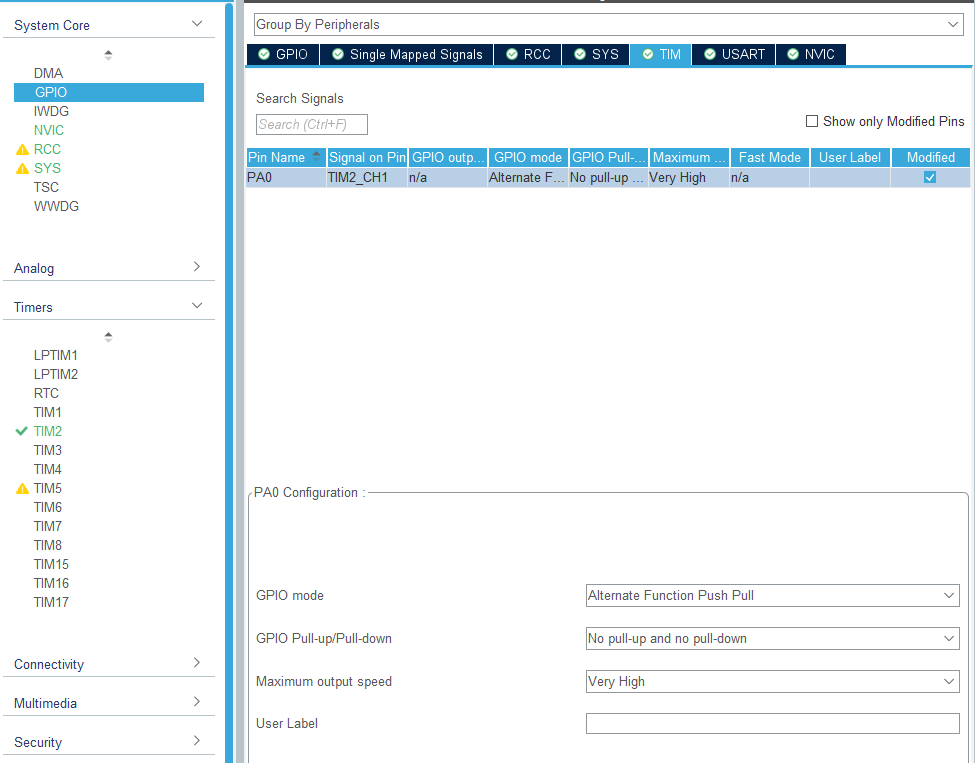

# 基本定时器

TIM6,TIM7属于基本定时器

TIM1,TIM8属于高级定时器

TIM2,TIM3,TIM4,TIM5属于通用定时器


使用基本定时器TIM6每隔1s产生一次更新中断


激活TIM6



按上图设定时基单元,生成代码


找到定时器中断回调函数,在其中写上想要执行的代码

```c
void HAL_TIM_PeriodElapsedCallback(TIM_HandleTypeDef *htim)
{
  /* Prevent unused argument(s) compilation warning */
  if(htim->Instance==TIM6){
      HAL_GPIO_TogglePin(LD2_GPIO_Port,LD2_Pin);		//每隔1秒,改变LED灯的状态
  }

  /* NOTE : This function should not be modified, when the callback is needed,
            the HAL_TIM_PeriodElapsedCallback could be implemented in the user file
   */
}
```


于main函数中启动定时器

```c
HAL_TIM_Base_Start_IT(&htim6);		//启动定时器
```

然后下载你就可以看到LED灯亮一秒灭一秒

# 通用定时器

使用通用定时器的输出比较功能产生PWM波



参数按照上图设定


最多再把PA0 GPIO口的速度调到最大




在程序中就只需要开启PWM输出就行了,用以下函数

```c
HAL_TIM_PWM_Start(&htim2,TIM_CHANNEL_1);
```

然后你就会在PA0口用示波器观察到输出的PWM波